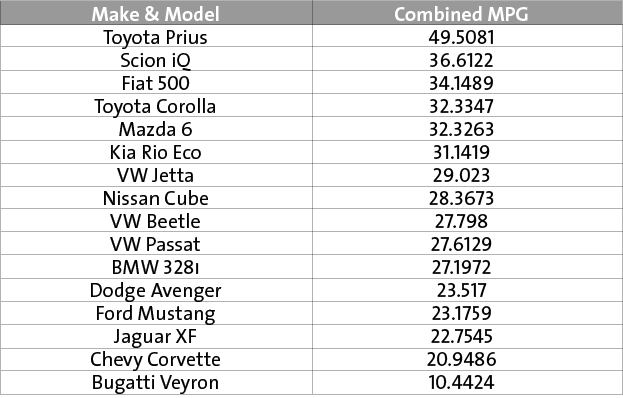

## A tool for making interactive March Madness-style brackets

Sample screenshot. 

  

##Examples in the wild

[Which of These 16 Cars Wins the Fuel-Efficiency Smackdown?](http://www.motherjones.com/environment/2014/04/auto-bracket-miles-per-gallon)  

##How it works

Your "players" go in the ``player`` column. The metric you're scoring them against goes in the ``score`` column.

The bracket doesn't show on mobile. Instead, we show a table of all of the players and their scores; this is a simple static graphic.

*MoJo staffers:* get started by following [these instructions](https://github.com/motherjones/story-tools#starting-a-new-project). When you're done, upload to s3 and embed in the shell [(how to)](https://github.com/motherjones/story-tools#starting-a-new-project).

##Spreadsheet template

[Here](https://docs.google.com/spreadsheet/ccc?key=0AuHOPshyxQGGdEwxa21COVI3QURwSVFDZ2dBNjFoVHc#gid=0)

*MoJo staffers:* Make a copy and move to the relevant beat folder. Change owner to MoJo Data in ``Share > Advanced``

##Modify these for your project

**In script.js:**

The code stays the same, but you'll need to upload a new table graphic.

    
\
    \

**In style.css**:

Here as well, the code stays the same, but you'll want to upload a new background image.

    .bracket_container {
      ...
      background-image: url('../img/bg.png');
    }
